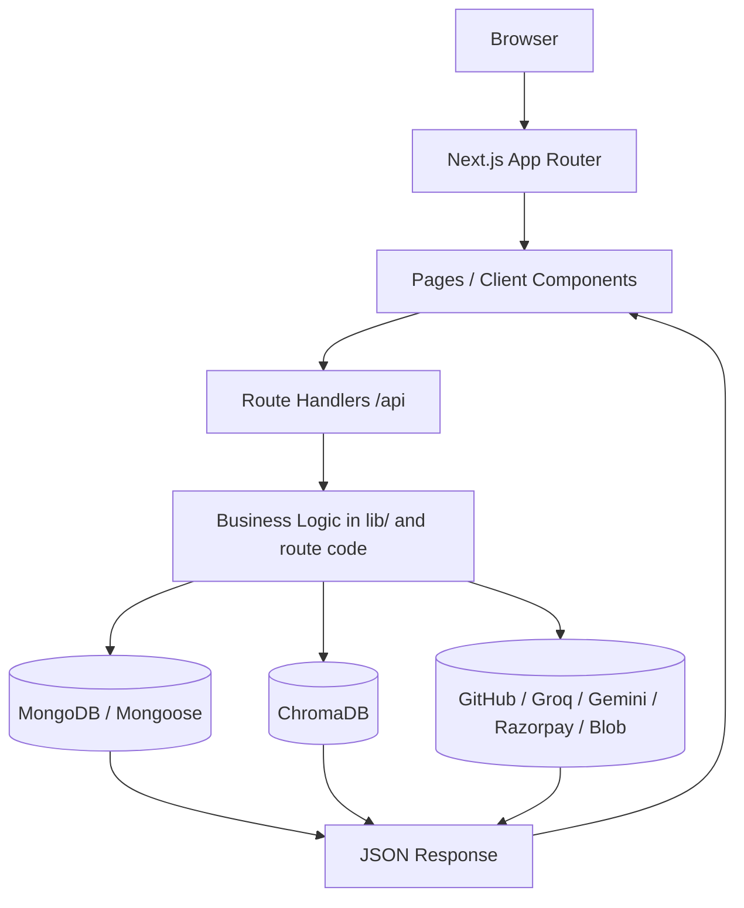
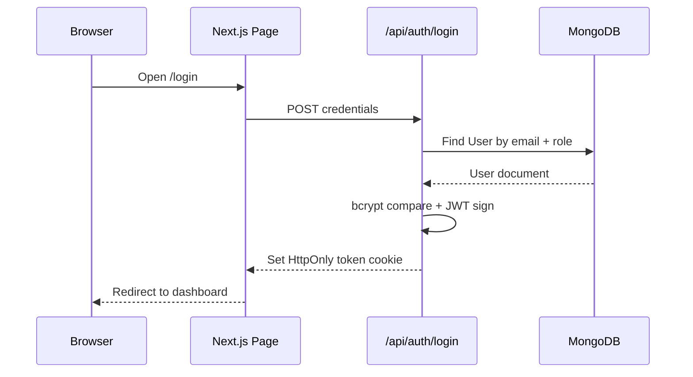
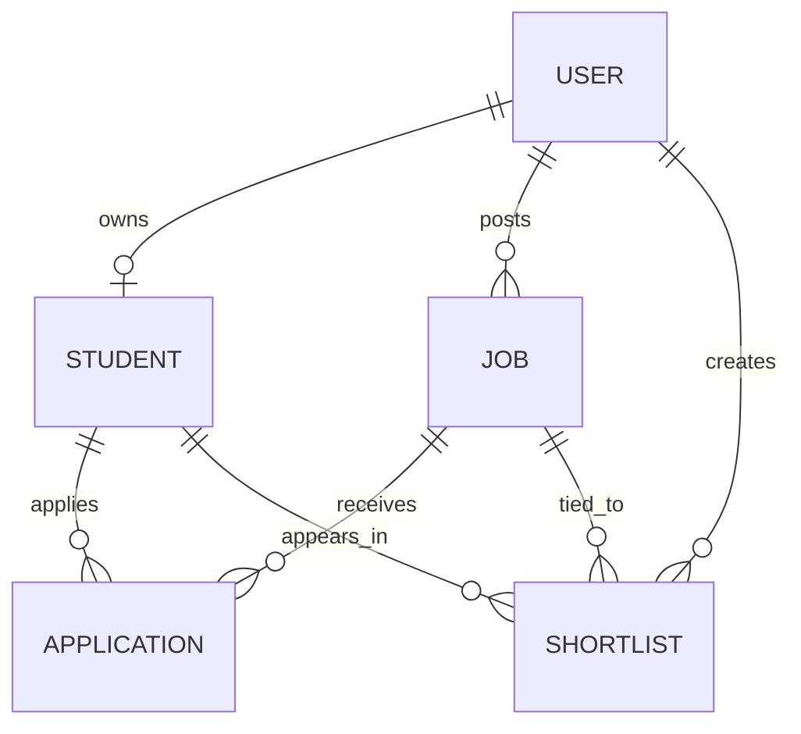
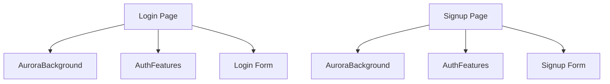
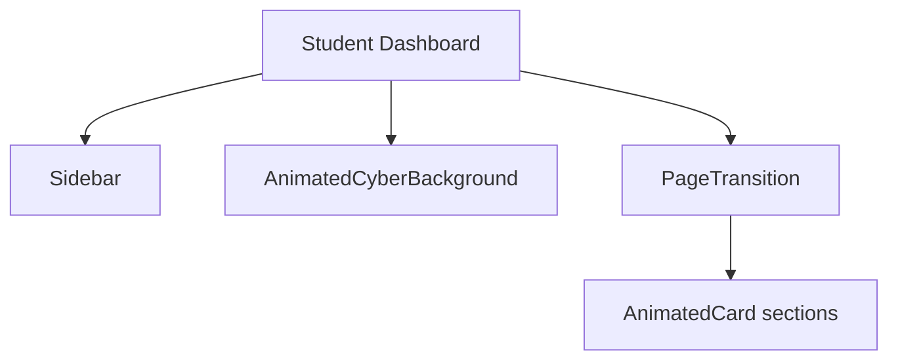
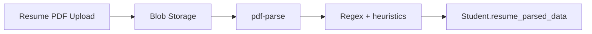
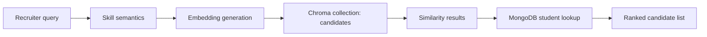

# RecruitPro - Campus Recruitment Platform

RecruitPro is a full-stack campus recruitment platform built with Next.js App Router, MongoDB, JWT authentication, optional Redis caching, ChromaDB-powered semantic search, GitHub enrichment, and Razorpay-based paid job postings.

This README is intentionally written as both project documentation and interview preparation notes. It explains how the system works end to end, how files interact, and where the current production gaps are.

---

## Table of Contents

1. [Project Overview](#project-overview)
2. [High Level Architecture](#high-level-architecture)
3. [Complete Folder Structure](#complete-folder-structure)
4. [File-by-File Documentation](#file-by-file-documentation)
5. [End-to-End User Flow](#end-to-end-user-flow)
6. [Feature Documentation](#feature-documentation)
7. [Complete Tech Stack](#complete-tech-stack)
8. [Database Design](#database-design)
9. [API Documentation](#api-documentation)
10. [Component Tree](#component-tree)
11. [State Management](#state-management)
12. [Authentication Flow](#authentication-flow)
13. [AI / ML Flow](#ai--ml-flow)
14. [Next.js Concepts Used](#nextjs-concepts-used)
15. [Performance Optimizations](#performance-optimizations)
16. [Security](#security)
17. [Deployment Guide](#deployment-guide)
18. [Debugging Guide](#debugging-guide)
19. [Scalability](#scalability)
20. [Interview Preparation](#interview-preparation)
21. [STAR Stories](#star-stories)
22. [Cross Questions](#cross-questions)
23. [Resume Explanation](#resume-explanation)
24. [Revision Notes](#revision-notes)
25. [Improvements](#improvements)

---

## Project Overview

### What problem this project solves

RecruitPro solves the manual and fragmented campus recruitment workflow for both students and recruiters.

Students can create profiles, upload resumes, connect GitHub, answer cultural-fit tests, view recommendations, and track applications. Recruiters can create jobs, search candidates, shortlist students, view analytics, and inspect student profiles.

### Target users

| User type | What they do |
|---|---|
| Students | Build a profile, upload resume/photo/ID card, connect GitHub, apply to jobs, view analytics and recommendations |
| Recruiters | Post jobs, search candidates, use semantic search, shortlist candidates, review analytics |
| Admin-like public users | Submit recommendation letters for students through a public link |

### Why this project exists

The project exists to reduce the friction between campus students and recruiters by combining profile management, job discovery, application tracking, semantic matching, and AI-assisted insights into one product.

### Business use case

This is a campus placement SaaS platform that can be sold to universities, training institutes, and hiring teams. The platform can also support paid job postings via Razorpay.

### Real-world applications

| Area | Example use |
|---|---|
| University placement cell | Manage student profiles and placement pipelines |
| Recruiter sourcing | Search students by skill fit and background |
| Student branding | Showcase resume, GitHub, and recommendations |
| HR analytics | Measure funnel metrics and shortlist efficiency |

### Why this architecture was chosen

The architecture favors a single Next.js application because:

| Decision | Reason |
|---|---|
| Next.js App Router | Supports pages, layouts, and API routes in one codebase |
| MongoDB + Mongoose | Flexible schema for student/resume/profile data |
| JWT cookies | Simple authentication across client and server routes |
| ChromaDB | Enables semantic candidate search beyond keyword matching |
| Razorpay | Supports payment-gated job posting |
| GitHub API | Adds real-world developer evidence to student profiles |

---

## High Level Architecture

The system is organized as a layered monolith:



### Request lifecycle

1. Browser loads a page.
2. Next.js renders the page shell or server output.
3. Client components fetch data from route handlers.
4. Route handlers authenticate and validate requests.
5. Business logic reads or writes MongoDB, ChromaDB, or external services.
6. The route returns JSON.
7. The client updates state and re-renders UI.

### Two-path architecture

The app has two major flows:

| Flow | Example |
|---|---|
| Student flow | Profile updates, recommendations, applications, analytics |
| Recruiter flow | Job creation, candidate search, shortlist, analytics |

---

## Complete Folder Structure

### Root

| Folder / file | Purpose | Why it exists | Interaction |
|---|---|---|---|
| [app](app) | Next.js routes, pages, layouts, and API handlers | Main application surface | Drives all UI and backend behavior |
| [components](components) | Shared UI and background primitives | Prevents duplication across pages | Used by student and recruiter pages |
| [lib](lib) | Shared business utilities and service clients | Centralizes DB, Redis, Chroma, and semantic utilities | Imported by routes and pages |
| [models](models) | Mongoose schemas | Defines the persistent data model | Used by API routes |
| [public](public) | Static assets and uploads | Browser-accessible images and files | Referenced directly by the UI |
| [chroma](chroma) | Local Chroma DB artifacts | Development/local semantic search storage | Used by local Chroma server |
| [chroma_data](chroma_data) | Secondary Chroma artifact store | Local persistence for vector DB | Same purpose as [chroma](chroma) |
| [render.yaml](render.yaml) | Render blueprint | Repeatable deployment config | Render reads it during deploy |
| [next.config.js](next.config.js) | Next.js config | Handles native modules and externals | Controls build bundling |
| [tailwind.config.js](tailwind.config.js) | Tailwind scan config | Enables utility CSS across app | Used at build time |
| [postcss.config.js](postcss.config.js) | PostCSS config | Tailwind compilation | Used at build time |
| [jsconfig.json](jsconfig.json) | JS path alias config | Supports `@/` imports | Used by editor and Next.js |
| [start-chromadb.ps1](start-chromadb.ps1) | Local Chroma startup script | Makes semantic search runnable locally | Development helper |
| [test-chroma-sync.js](test-chroma-sync.js) | Manual Chroma sync tester | Debugging utility | Hits `/api/chroma/sync` |
| [test-semantic-matching.js](test-semantic-matching.js) | Semantic matching demo | Local experimentation | Not wired into app |

### `app/`

| Subfolder | Purpose | Responsibilities |
|---|---|---|
| [app/login](app/login) | Login page | Auth form and redirect logic |
| [app/signup](app/signup) | Signup page | Account creation UI |
| [app/recommend/[id]](app/recommend/%5Bid%5D) | Public recommendation form | Collects third-party recommendation data |
| [app/student](app/student) | Student dashboard suite | Student-facing flows |
| [app/recruiter](app/recruiter) | Recruiter dashboard suite | Recruiter-facing flows |
| [app/api/auth](app/api/auth) | Login/signup/logout APIs | Authentication |
| [app/api/student](app/api/student) | Student profile/applications/upload APIs | Student data workflows |
| [app/api/recruiter](app/api/recruiter) | Recruiter jobs/search/shortlist/analytics APIs | Recruiter workflows |
| [app/api/chroma](app/api/chroma) | Vector sync/search APIs | Semantic search |
| [app/api/ai](app/api/ai) | AI scoring API | Retention prediction |
| [app/api/chat](app/api/chat) | Assistant API | Simple role-based chatbot |
| [app/api/public](app/api/public) | Public profile lookup | Used by recommendation form |
| [app/api/razorpay](app/api/razorpay) | Payment APIs | Paid job posting |

### `components/`

| File | Purpose |
|---|---|
| [Sidebar.js](components/Sidebar.js) | Role-aware navigation shell |
| [PageTransition.js](components/PageTransition.js) | Page enter animation wrapper |
| [AnimatedCard.js](components/AnimatedCard.js) | Motion card wrapper |
| [AnimatedCyberBackground.js](components/AnimatedCyberBackground.js) | Dark animated background |
| [AuroraBackground.js](components/AuroraBackground.js) | Auth page backdrop |
| [AuthFeatures.js](components/AuthFeatures.js) | Login/signup promotional panel |
| [ChromaDBStatus.js](components/ChromaDBStatus.js) | Chroma status and sync widget |
| [AIChatbot.js](components/AIChatbot.js) | Floating assistant |
| [ThreeBackground.js](components/ThreeBackground.js) | 3D fallback background |

### `lib/`

| File | Purpose |
|---|---|
| [mongodb.js](lib/mongodb.js) | Cached Mongoose connection |
| [redis.js](lib/redis.js) | Lazy Redis client |
| [chromadb.js](lib/chromadb.js) | Chroma REST + embedding bridge |
| [skillSemantics.js](lib/skillSemantics.js) | Semantic skill expansion/matching helper |

### `models/`

| File | Purpose |
|---|---|
| [User.js](models/User.js) | Auth identity |
| [Student.js](models/Student.js) | Student profile aggregate |
| [Job.js](models/Job.js) | Recruiter job posting |
| [Application.js](models/Application.js) | Student-job application record |
| [Shortlist.js](models/Shortlist.js) | Recruiter shortlist record |

### `public/`

| Folder | Purpose |
|---|---|
| [public/images](public/images) | Static UI assets and backgrounds |
| [public/uploads](public/uploads) | Uploaded photos and ID cards |

---

## File-by-File Documentation

This section documents the files that control the behavior of the app. It does not restate every single UI element line-by-line, but it does explain the files that actually define architecture and runtime behavior.

### Core app files

| File | Purpose | Who calls it | What it calls |
|---|---|---|---|
| [app/layout.js](app/layout.js) | Root HTML wrapper and metadata | Next.js runtime | [app/globals.css](app/globals.css) |
| [app/page.js](app/page.js) | Redirects to login | Browser on `/` | `redirect('/login')` |
| [app/globals.css](app/globals.css) | Global dark theme and component utilities | All UI | Tailwind and custom class names |
| [next.config.js](next.config.js) | Webpack customization and native module handling | Next build | `null-loader`, externals |
| [package.json](package.json) | Dependency and script manifest | npm / Render | `next dev`, `next build`, `next start` |
| [render.yaml](render.yaml) | Render service definition | Render | npm install/build/start |
| [jsconfig.json](jsconfig.json) | Path alias config | Editor and Next.js | `@/` imports |
| [tailwind.config.js](tailwind.config.js) | Tailwind content scan paths | Tailwind build | app/components scanning |
| [postcss.config.js](postcss.config.js) | CSS processing pipeline | Build step | Tailwind + Autoprefixer |

### Shared utilities

| File | Purpose | Imports | Exports | Notes |
|---|---|---|---|---|
| [lib/mongodb.js](lib/mongodb.js) | Shared DB connection | `mongoose` | default `connectDB` | Used by nearly all API routes |
| [lib/redis.js](lib/redis.js) | Redis client | `redis` | `getRedisClient` | Optional cache layer |
| [lib/chromadb.js](lib/chromadb.js) | Vector search and embeddings | `@huggingface/transformers`, `path` | Chroma helpers | Heavy cold-start path |
| [lib/skillSemantics.js](lib/skillSemantics.js) | Skill matching logic | internal helpers | semantic skill API | Used by recruiter search |

### Models

| File | Purpose | Key fields | Important design choice |
|---|---|---|---|
| [models/User.js](models/User.js) | Auth account | name, email, password, role | Simple identity table |
| [models/Student.js](models/Student.js) | Student aggregate | profile, resume, GitHub, cultural fitness, recommendations | Embeds product data to avoid joins |
| [models/Job.js](models/Job.js) | Job posting | recruiter_id, title, description, skills, applications_count | Reference to recruiter |
| [models/Application.js](models/Application.js) | Application record | student_id, job_id, status, match_score | Unique compound index |
| [models/Shortlist.js](models/Shortlist.js) | Shortlist record | recruiter_id, student_id, job_id, notes | Unique compound index |

### UI / layout components

| File | Purpose | Reuse pattern |
|---|---|---|
| [components/Sidebar.js](components/Sidebar.js) | Shared navigation | Used by authenticated pages |
| [components/PageTransition.js](components/PageTransition.js) | Framer Motion wrapper | Wraps page content areas |
| [components/AnimatedCard.js](components/AnimatedCard.js) | Card animation | Used in dashboards and forms |
| [components/AnimatedCyberBackground.js](components/AnimatedCyberBackground.js) | Visual identity layer | Student/recruiter dashboards |
| [components/AuroraBackground.js](components/AuroraBackground.js) | Auth landing backdrop | Login/signup |
| [components/AuthFeatures.js](components/AuthFeatures.js) | Feature carousel | Login/signup side panel |

### Key route files

| File | Purpose | Important behavior |
|---|---|---|
| [app/login/page.js](app/login/page.js) | Login UI | Posts to `/api/auth/login` |
| [app/signup/page.js](app/signup/page.js) | Signup UI | Posts to `/api/auth/signup` |
| [app/student/profile/page.js](app/student/profile/page.js) | Student profile editor | Uploads files, saves profile, GitHub connect |
| [app/student/dashboard/page.js](app/student/dashboard/page.js) | Student landing page | Shows metrics and recommendations |
| [app/student/jobs/page.js](app/student/jobs/page.js) | Student job browser | Fetches recommendations/jobs |
| [app/student/applications/page.js](app/student/applications/page.js) | Application tracker | Reads `/api/student/applications` |
| [app/student/analytics/page.js](app/student/analytics/page.js) | Student analytics | Reads `/api/student/analytics` |
| [app/student/cultural-test/page.js](app/student/cultural-test/page.js) | Cultural fit test | Persists test outcome |
| [app/student/github-analytics/page.js](app/student/github-analytics/page.js) | GitHub profile analytics | Reads GitHub-enriched backend data |
| [app/student/ai-copilot/page.js](app/student/ai-copilot/page.js) | AI coach | Presentational client-side assistant |
| [app/recruiter/dashboard/page.js](app/recruiter/dashboard/page.js) | Recruiter landing page | KPI overview |
| [app/recruiter/jobs/page.js](app/recruiter/jobs/page.js) | Recruiter jobs list | Reads and manages jobs |
| [app/recruiter/jobs/new/page.js](app/recruiter/jobs/new/page.js) | Paid job creation | Uses Razorpay checkout |
| [app/recruiter/candidates/page.js](app/recruiter/candidates/page.js) | Candidate discovery | Standard vs semantic search |
| [app/recruiter/shortlist/page.js](app/recruiter/shortlist/page.js) | Shortlist management | Review and outreach |
| [app/recruiter/analytics/page.js](app/recruiter/analytics/page.js) | Recruiter analytics | Shows funnel metrics |
| [app/recruiter/student-profile/[id]/page.js](app/recruiter/student-profile/[id]/page.js) | Recruiter profile detail | Deep profile inspection |
| [app/recommend/[id]/page.js](app/recommend/[id]/page.js) | Public recommendation form | Verifies and submits recommendations |

---

## End-to-End User Flow

### Student login flow



### Student profile update flow

1. The student opens [app/student/profile/page.js](app/student/profile/page.js).
2. The page fetches existing student profile data from `/api/student/profile`.
3. The student uploads a resume, photo, or ID card.
4. The client sends the file to the corresponding route handler.
5. The API route stores the file, extracts or updates data, and writes to MongoDB.
6. The page re-fetches data and re-renders updated profile state.

### Recruiter search flow

1. The recruiter opens [app/recruiter/candidates/page.js](app/recruiter/candidates/page.js).
2. The page fetches jobs and shortlist state.
3. The recruiter picks a job and optional filters.
4. The page calls either `/api/recruiter/search-candidates` or `/api/chroma/search`.
5. The route validates recruiter access and queries MongoDB or ChromaDB.
6. The page renders sorted candidates and allows shortlisting.

### Public recommendation flow

1. A mentor or professor opens the public recommendation link.
2. The page loads student basic info from `/api/public/student-info/[id]`.
3. The recommender fills in structured assessment fields.
4. The form posts to `/api/student/recommendations`.
5. The backend stores the recommendation in the student record.

---

## Feature Documentation

### 1. Authentication

| Aspect | Implementation |
|---|---|
| Signup | Creates User and Student record when role is student |
| Login | Validates password with bcrypt and signs JWT |
| Cookie | JWT stored as HttpOnly cookie named `token` |
| Logout | Deletes cookie |
| Authorization | Route handlers inspect cookie and role |

### 2. Student profile management

| Feature | Files involved | Backend effect |
|---|---|---|
| Edit profile | [app/student/profile/page.js](app/student/profile/page.js), [app/api/student/profile/route.js](app/api/student/profile/route.js) | Updates user and student records |
| Resume upload | [app/api/student/upload-resume/route.js](app/api/student/upload-resume/route.js) | Parses resume and updates structured profile data |
| Photo upload | [app/api/student/upload-photo/route.js](app/api/student/upload-photo/route.js) | Stores public photo URL |
| ID card upload | [app/api/student/upload-idcard/route.js](app/api/student/upload-idcard/route.js) | Stores public ID card URL |
| GitHub connect | [app/api/student/connect-github/route.js](app/api/student/connect-github/route.js) | Pulls GitHub metrics and stores them |

### 3. Job discovery and application

| Feature | Implementation |
|---|---|
| Recommended jobs | Scans jobs and ranks by skill overlap |
| Apply to job | Creates Application and increments Job.applications_count |
| Applications tracker | Populates jobs for the current student |
| Job browsing | Student UI reads recommendation endpoints |

### 4. Recruiter candidate discovery

| Mode | Implementation | Why it exists |
|---|---|---|
| Standard search | MongoDB query + score computation | Simpler keyword-driven matching |
| Semantic search | Chroma vectors + semantic skill expansion + retention scoring | Better matching for related skills |
| Shortlist | Persists recruiter interest | Helps later outreach and analytics |

### 5. Analytics

| Analytics area | Data source | Use case |
|---|---|---|
| Student analytics | Student profile + applications | Profile completion and application progress |
| Recruiter analytics | Jobs + applications + shortlist | Hiring funnel and skill gap visibility |
| GitHub analytics | GitHub API | Evidence of activity and technical depth |

### 6. Payments

| Feature | Files | Notes |
|---|---|---|
| Razorpay order creation | [app/api/razorpay/create-order/route.js](app/api/razorpay/create-order/route.js) | Creates payment order for job posting |
| Razorpay verification | [app/api/razorpay/verify/route.js](app/api/razorpay/verify/route.js) | Verifies signature on client response |

---

## Complete Tech Stack

| Technology | Why selected | Advantages | Tradeoffs / alternatives |
|---|---|---|---|
| Next.js 14 App Router | Full-stack React framework | Pages + APIs + SSR in one repo | More framework complexity than plain React |
| React 18 | UI composition | Component model and hooks | Requires careful client/server boundaries |
| MongoDB + Mongoose | Flexible schema for recruitment data | Easy nested profile modeling | Denormalization can get messy |
| JWT | Stateless auth | Easy cookie-based auth | Manual role checks needed |
| Tailwind CSS | Fast UI styling | Consistent utility workflow | Class-heavy markup |
| Framer Motion | Modern page/card animations | Strong UI polish | Adds client bundle weight |
| ChromaDB | Semantic vector search | Better than keyword-only search | Requires separate vector service |
| Redis | Optional caching | Good for search and session-like caching | Not fully utilized in current code |
| Razorpay | Payments | Production-ready checkout | External dependency and webhook design needed |
| GitHub API | Profile enrichment | Real evidence of work | Rate limiting |
| Groq / Gemini | AI scoring | Fast model access | Prompt/cost/rate-limit constraints |
| Vercel Blob | File storage | Simple upload persistence | Requires external service |
| Render | Deployment | Simple Node deploys | Separate services needed for DB/vector stores |

### Why Next.js instead of plain React?

Because this project needs both frontend pages and backend route handlers. Next.js reduces the number of moving parts and makes auth, API routes, and deployment simpler.

### Why MongoDB?

Student and resume data are semi-structured and evolve frequently. MongoDB is a good fit because nested documents and optional fields are common in recruitment systems.

### Why Tailwind?

The product uses a dense dashboard UI with many states. Tailwind keeps styling close to the component and makes theme consistency easier.

### Why ChromaDB?

Recruiter search needs semantic matching, not only exact keywords. Chroma provides vector similarity search for that use case.

---

## Database Design

### Relationship map



### Schema summaries

#### User

| Field | Type | Notes |
|---|---|---|
| name | String | Required |
| email | String | Unique and required |
| password | String | Bcrypt hashed |
| role | String | `student` or `recruiter` |

#### Student

| Field group | Purpose |
|---|---|
| user_id | Foreign key to User |
| contact/profile | Phone, LinkedIn, photo, ID card |
| academic info | current year, education, achievements |
| resume data | parsed skills, education, experience, certifications |
| GitHub data | username, repos, followers, languages, profile URL |
| cultural data | work style, goals, collaboration, etc. |
| assessment | gamified scores and persona |
| recommendations | third-party recommendations |
| analytics | retention score and profile completion |

#### Job

| Field | Purpose |
|---|---|
| recruiter_id | Owner of the job |
| title / description | Job content |
| location / salary_range | Listing details |
| experience_level | Role seniority |
| required_skills | Matching input |
| applications_count | Simple funnel metric |

#### Application

| Field | Purpose |
|---|---|
| student_id | Applicant |
| job_id | Job applied to |
| status | Application stage |
| match_score | Computed fit |
| cover_letter / notes | Optional text |

#### Shortlist

| Field | Purpose |
|---|---|
| recruiter_id | Shortlist owner |
| student_id | Candidate |
| job_id | Target job |
| notes | Recruiter comments |
| status | Shortlist stage |

### Query and indexing strategy

| Collection | Index | Benefit |
|---|---|---|
| Application | `{ student_id, job_id }` unique | Prevents duplicate applies |
| Shortlist | `{ recruiter_id, student_id, job_id }` unique | Prevents duplicate shortlists |
| User | email unique | Fast login lookup |

### Data flow

1. Auth creates or identifies a User.
2. Student profile data is stored on Student.
3. Job posts are stored on Job.
4. Applications connect Student and Job.
5. Shortlists connect Recruiter, Student, and Job.

---

## API Documentation

### Auth endpoints

| Method | URL | Purpose | Auth |
|---|---|---|---|
| POST | `/api/auth/signup` | Create account | Public |
| POST | `/api/auth/login` | Log in and set cookie | Public |
| POST | `/api/auth/logout` | Clear cookie | Logged-in user |

### Student endpoints

| Method | URL | Purpose | Auth |
|---|---|---|---|
| GET / PUT | `/api/student/profile` | Fetch/update student profile | Student |
| POST | `/api/student/upload-resume` | Upload and parse resume | Student |
| POST | `/api/student/upload-photo` | Upload photo | Student |
| POST | `/api/student/upload-idcard` | Upload ID card | Student |
| POST | `/api/student/connect-github` | Pull GitHub profile data | Student |
| POST | `/api/student/cultural-test` | Store cultural fit outcome | Student |
| POST | `/api/student/apply` | Apply to a job | Student |
| GET | `/api/student/applications` | List student applications | Student |
| GET | `/api/student/recommended-jobs` | Recommend jobs by skill overlap | Student |
| GET | `/api/student/analytics` | Student dashboard analytics | Student |
| GET | `/api/student/github-analytics` | GitHub analytics | Student |
| POST / GET / PUT | `/api/student/recommendations` | Create and manage recommendations | Mixed |

### Recruiter endpoints

| Method | URL | Purpose | Auth |
|---|---|---|---|
| GET / POST | `/api/recruiter/jobs` | List and create jobs | Recruiter |
| GET | `/api/recruiter/search-candidates` | Standard candidate search | Recruiter |
| GET / POST / DELETE | `/api/recruiter/shortlist` | Manage shortlist | Recruiter |
| GET | `/api/recruiter/analytics` | Recruiter analytics | Recruiter |
| GET | `/api/recruiter/student-profile/[id]` | Deep profile view | Recruiter |

### AI / vector / payment endpoints

| Method | URL | Purpose | Auth |
|---|---|---|---|
| GET / POST | `/api/chroma/sync` | Chroma stats and sync | Recruiter |
| GET | `/api/chroma/search` | Semantic search | Recruiter |
| POST | `/api/ai/calculate-retention` | Gemini retention score | Student/recruiter scenario |
| POST | `/api/chat` | Simple assistant responses | UI only |
| POST | `/api/razorpay/create-order` | Create payment order | Recruiter |
| POST | `/api/razorpay/verify` | Verify payment signature | Recruiter |
| GET | `/api/public/student-info/[id]` | Public student lookup | Public |

### Endpoint flow pattern

Every protected endpoint generally follows this pattern:

1. Read cookie or token.
2. Verify JWT.
3. Check user role.
4. Connect to MongoDB.
5. Read or mutate documents.
6. Return JSON.

---

## Component Tree

### Auth pages



### Student dashboard tree



### Recruiter dashboard tree


### Prop and state relationships

| Component | Key state / props |
|---|---|
| Sidebar | `role` |
| PageTransition | `className`, children |
| AnimatedCard | `index`, `className`, children |
| AuthFeatures | internal content rotation |
| ChromaDBStatus | sync stats and loading state |
| AIChatbot | messages, input, send actions |

---

## State Management

### What is local state?

Most pages use React `useState` and `useEffect` to track form values, loading flags, fetched data, and error states.

### What is server state?

Server state lives in MongoDB and is fetched through route handlers. The UI often re-fetches after mutation rather than relying on a global store.

### What is shared state?

There is no Redux or Context-based global store. Shared behavior is pushed down through reusable components and route handlers.

### Caching

| Layer | Status |
|---|---|
| React state | Used extensively |
| Next.js cache | Not explicitly managed in most routes |
| Redis | Present but only lightly integrated |
| Chroma cache | Local vector persistence and model cache |

### Client/server split

| Pattern | Example |
|---|---|
| Client component | Login form, dashboards, profile editor |
| Server route | Auth, profile updates, search, analytics |
| Hydration risk | Components using browser APIs during render |

---

## Authentication Flow

### Signup

1. User submits name, email, password, and role.
2. Password is hashed with bcrypt.
3. A User document is created.
4. If the role is student, a Student record is created.

### Login

1. User submits email, password, and role.
2. Server finds the User by email and role.
3. bcrypt compares the password.
4. A signed JWT is created.
5. JWT is stored in an HttpOnly cookie.
6. Frontend navigates to the correct dashboard.

### Authorization

The app uses route-by-route authorization.

| Check | Where used |
|---|---|
| JWT verification | Most API routes |
| Role check | Student vs recruiter endpoints |
| Cookie reading | Route handlers and some pages |

### Logout

Logout deletes the `token` cookie and returns the user to the login page.

### Security notes

| Area | Observation |
|---|---|
| Passwords | Bcrypt hashed |
| Session storage | Stateless JWT cookie |
| CSRF | Not explicitly hardened |
| Middleware | Not centralized |

---

## AI / ML Flow

### Resume parsing

The resume pipeline extracts text from PDF and converts it into structured profile data.



### Semantic search



### Retention scoring

The project uses AI to estimate candidate retention from cultural fit and gamified assessment data.

| Path | Model / tool | Output |
|---|---|---|
| `/api/ai/calculate-retention` | Gemini | Retention score and reasoning |
| `/api/chroma/search` | Groq + Chroma + semantic skill logic | Ranked semantic candidates |
| `/api/recruiter/search-candidates` | Groq | Score + reasoning per candidate |

### AI architecture tradeoff

The design mixes deterministic heuristics with model-backed scoring. That is good for explainability, but it also means the system can drift if the prompt or schema changes.

---

## Next.js Concepts Used

| Concept | Where used | Why it matters |
|---|---|---|
| App Router | Entire [app](app) tree | Modern routing model |
| Layouts | [app/layout.js](app/layout.js) | Shared HTML shell |
| Client Components | Most pages | Interactivity and hooks |
| Route Handlers | `app/api/**/route.js` | Backend endpoints |
| Dynamic Routes | `[id]` routes | Student profiles and recommendations |
| Redirects | [app/page.js](app/page.js) | Directs root traffic to login |
| SSR / server rendering | API-backed pages | Data available before or during render |
| CSR | Dashboards and forms | Fast interactive UX |
| Static assets | [public](public) | Images/uploads served directly |

### App Router specifics

The App Router lets the project colocate page UI and backend route handlers. That reduces boilerplate and keeps feature ownership close together.

---

## Performance Optimizations

| Area | Current approach | Risk / note |
|---|---|---|
| Component reuse | Shared Sidebar/Card/Backgrounds | Good for bundle consistency |
| Lazy rendering | Motion components per page | Some pages are client-heavy |
| DB connection reuse | Cached Mongoose connection | Important for serverless-like runtime |
| Search ranking | Semantic search and keyword search | Can be expensive without caching |
| Chroma embeddings | Cached model and local AI cache dir | Cold start can still be expensive |
| Redis | Available but lightly used | Good target for future search cache |

### Bottlenecks

| Bottleneck | Why |
|---|---|
| Resume parsing | PDF extraction and parsing cost |
| GitHub analytics | Multiple external API calls |
| Semantic search | Embedding generation + vector store queries |
| Recruiter search | Full Mongo scan in standard path |

---

## Security

| Topic | Current state | Recommended hardening |
|---|---|---|
| Auth | JWT cookie-based | Add centralized middleware |
| Passwords | bcrypt | Keep as-is |
| Secrets | Env vars | Never commit secrets |
| Validation | Basic field checks | Add schema-level validation and shared validators |
| Authorization | Manual per route | Centralize role checks |
| Uploads | Public file storage | Restrict sensitive file exposure |
| CSRF | Not explicit | Add origin checks / CSRF protection |
| Rate limiting | Not explicit | Add request throttling |
| Injection | Mongoose reduces risk | Still validate inputs |
| XSS | React escapes by default | Avoid unsafe HTML rendering |

### Sensitive production warning

Uploaded photos and ID cards currently live under [public/uploads](public/uploads), which means they are publicly reachable if deployed as-is. That is not ideal for a production recruitment system.

---

## Deployment Guide

### Local development

```bash
npm install
npm run dev
```

### Production build

```bash
npm run build
npm start
```

### Render deployment

1. Push the repo to GitHub.
2. Create a new Render Blueprint.
3. Connect the repository.
4. Render reads [render.yaml](render.yaml).
5. Set environment variables.
6. Deploy the service.

### Required environment variables

| Variable | Used by | Purpose |
|---|---|---|
| MONGODB_URI | `lib/mongodb.js` | MongoDB connection string |
| JWT_SECRET | auth routes | JWT signing/verification |
| GROQ_API_KEY | Chroma search | AI scoring |
| GEMINI_API_KEY | retention AI route | Gemini retention scoring |
| GITHUB_TOKEN | GitHub connect/analytics | GitHub API access |
| NEXT_PUBLIC_KEY_ID | Razorpay | Payment checkout public key |
| NEXT_PUBLIC_KEY_SECRET or RAZORPAY_SECRET | Razorpay | Payment signature verification |
| REDIS_URL | `lib/redis.js` | Optional Redis cache |
| CHROMA_URL | `lib/chromadb.js` | Chroma service endpoint |
| BLOB_READ_WRITE_TOKEN | resume/photo/id uploads | Vercel Blob access |

### Render notes

| Item | Detail |
|---|---|
| Build command | `npm install && npm run build` |
| Start command | `npm start` |
| Node version | 20.18.1 |
| Service type | Web service |

### Why deployment is not fully self-contained

The app expects external services for MongoDB, ChromaDB, Redis, GitHub, Blob storage, and payment gateways. Render only hosts the Node app itself.

---

## Debugging Guide

### Common bugs and causes

| Bug | Why it occurs | Fix |
|---|---|---|
| Missing env var crash | Route requires a secret or DB URI | Set the variable in Render/local `.env` |
| Login fails | JWT secret mismatch or bcrypt mismatch | Check password hash and `JWT_SECRET` |
| Search returns nothing | Chroma not running or empty collection | Start Chroma and sync candidates |
| Resume upload fails | File parser or Blob config issue | Check upload token and PDF format |
| GitHub analytics empty | Missing token or API limit | Set `GITHUB_TOKEN` |
| Build-time prerender errors | Browser-only code used during render | Move browser APIs into effects |

### Logging strategy

The project logs route-level errors to the server console. That is enough for local debugging, but a production system should ship logs to a centralized platform.

---

## Scalability

### 10 users

The system is fine as a single Next.js app with one MongoDB database and local Chroma.

### 100 users

Caching becomes useful, especially for jobs, analytics, and GitHub enrichment.

### 1,000 users

You would start to care about query efficiency, CDN usage for static assets, and background jobs for parsing and vector sync.

### 10,000 users

Split heavy workflows into background workers. Move file storage out of public disk paths. Add stronger search caching and better indexes.

### 100,000 users

At this scale, the architecture should evolve toward separate services:

| Area | Likely change |
|---|---|
| Auth | Dedicated auth service or shared middleware |
| Search | Dedicated search/vector service |
| Uploads | Object storage with access control |
| Analytics | Async aggregation jobs |
| Observability | Tracing, metrics, log aggregation |

---

## Interview Preparation

Below is a large interview question bank based only on this project. Answers are intentionally concise so you can revise them quickly.

### Easy

1. What does RecruitPro do? It connects students and recruiters in a campus hiring workflow.
2. Why use Next.js? It combines frontend and backend in one framework.
3. What database is used? MongoDB with Mongoose.
4. How is auth handled? JWT stored in an HttpOnly cookie.
5. Why is a cookie used instead of localStorage? It is safer against XSS and works server-side.
6. What is the root route? It redirects to `/login`.
7. What is the student profile file? [app/student/profile/page.js](app/student/profile/page.js).
8. What is the recruiter candidate page? [app/recruiter/candidates/page.js](app/recruiter/candidates/page.js).
9. What does [lib/mongodb.js](lib/mongodb.js) do? It caches the MongoDB connection.
10. What does [models/User.js](models/User.js) store? Login identity data.
11. Why Tailwind? Fast consistent UI styling.
12. Why use Framer Motion? For polished page transitions and cards.
13. What is ChromaDB used for? Semantic search.
14. What is Razorpay used for? Paid job posting.
15. What does the public recommendation form do? It collects third-party references for a student.

### Medium

16. Why is Student a richer document than User? Student is the product profile; User is just identity.
17. Why store resume data inside Student? It keeps profile-related data together and avoids extra joins.
18. Why do applications have a compound unique index? To prevent duplicate applications.
19. Why do shortlist records have a compound unique index? To prevent duplicate shortlist entries.
20. How does recruiter search work in standard mode? It scans MongoDB and ranks by matching logic.
21. How does semantic search differ? It uses embeddings and vector similarity.
22. Why is semantic search valuable? It catches related skills and not just exact keyword matches.
23. Why is [lib/chromadb.js](lib/chromadb.js) expensive? It loads an embedding model in-process.
24. Why does the app use route handlers instead of Express? Next.js route handlers reduce framework sprawl.
25. What does [components/Sidebar.js](components/Sidebar.js) solve? Reusable role-based navigation.
26. Why is [components/PageTransition.js](components/PageTransition.js) helpful? It gives a consistent motion layer.
27. Why are some pages client components? They use hooks, browser APIs, and interactive state.
28. What data is fetched on student dashboard load? Profile, recommendations, applications, analytics.
29. What is the recruiter dashboard used for? Funnel tracking and hiring activity.
30. Why is Render used here? Simple Node hosting with blueprint support.
31. What is the purpose of [render.yaml](render.yaml)? It codifies deployment settings.
32. Why do uploads land in public? Simplicity, but it is not ideal for sensitive production data.
33. What does `profile_completion` represent? A progress metric for the student profile.
34. Why use GitHub analytics? It adds proof of technical engagement.
35. Why does the app use both `GROQ_API_KEY` and `GEMINI_API_KEY`? Different AI routes use different providers.

### Advanced

36. What is the biggest architecture tradeoff in this project? A monolith is simpler but heavier to scale.
37. Why is manual role checking a risk? It is easy to miss on a new route.
38. Why would middleware improve auth? It would centralize authorization logic.
39. Why is Redis not fully effective here? The code has a client, but the cache path is lightly used.
40. Why can public uploads be dangerous? Sensitive files become directly addressable.
41. Why is Chroma a separate service? Vector search is specialized and independent from MongoDB.
42. What breaks if Chroma is down? Semantic search and Chroma sync features.
43. What breaks if GitHub rate limits hit? Analytics and connect flows become degraded.
44. Why is resume parsing done in the API route? It needs server-only parsing libraries and storage writes.
45. Why is it useful to store parsed resume data? It enables search and analytics without reparsing the PDF.
46. Why does recruiter search compute retention score? It combines skill fit with candidate quality signals.
47. What is the risk in combining AI and deterministic scoring? Different data sources can conflict or drift.
48. Why is schema mismatch a problem? Analytics and UI can rely on fields that do not exist.
49. Why is [app/recruiter/student/[id]/page.js](app/recruiter/student/%5Bid%5D/page.js) important? It is a placeholder and should be completed or removed.
50. Why is `window.location` dangerous in render paths? It may break server rendering.
51. Why is using `cookies()` inside routes okay but risky for build-time behavior? Next.js may try to analyze routes during build.
52. Why are App Router route handlers good for this project? They colocate backend APIs with the UI features they serve.
53. Why does this app not need Redux? Most state is page-local or server-backed.
54. Why is analytics tricky in this app? It depends on multiple collections and external APIs.
55. Why should search be paginated later? Full scans and long result sets will not scale.

### System Design

56. How would you split this into services at scale? Auth, search, file processing, and analytics would separate first.
57. How would you add background processing? Use a job queue for resume parsing and sync tasks.
58. How would you secure uploaded files? Move them to private object storage with signed URLs.
59. How would you reduce Chroma latency? Precompute embeddings and cache query results.
60. How would you improve search relevance? Add hybrid search and ranking features.
61. How would you make recommendations better? Add historical apply behavior and job success signals.
62. How would you improve observability? Add structured logs, metrics, and tracing.
63. How would you support multi-tenant universities? Partition data by tenant and isolate admin access.
64. How would you make the app stateless enough for scaling? Keep sessions in JWT and externalize storage.
65. How would you prevent duplicate record creation? Keep unique indexes and idempotent APIs.

### React

66. Why use `useEffect` in profile pages? To fetch data after mount and sync browser state.
67. Why keep form state local? It avoids unnecessary global complexity.
68. Why use `AnimatePresence`? To animate conditional UI sections.
69. Why use `useState(new Set())` for shortlist IDs? Fast membership checks.
70. Why are client components necessary for file uploads? They need browser `File` objects and event handlers.
71. What causes unnecessary re-renders here? Large parent components with many local state fields.
72. How would you reduce re-renders? Split large pages into smaller components.
73. Why is `useSearchParams()` tricky in App Router? It can create CSR bailouts if used incorrectly.
74. Why is hydration important? Server HTML must match client interactivity.
75. Why use component composition? It keeps repeated motion and shell patterns reusable.

### Next.js

76. What is a route handler? A backend endpoint inside the App Router.
77. What is the layout file for? Shared HTML and metadata.
78. What does redirect on the root page do? It sends users to login immediately.
79. Why are route groups not used here? The tree is simple enough without them.
80. What is the app router advantage? It simplifies full-stack colocated code.
81. Why does Next.js work well for this project? It covers pages, APIs, and deployment in one framework.
82. What is a dynamic route here? `[id]` pages for student and recommendation views.
83. Why do server routes read cookies? To authenticate the request.
84. Why are some pages still static? Marketing/auth pages and some assets can be prerendered.
85. How should browser-only code be isolated? Put it inside effects or client-only components.

### JavaScript / Node.js

86. Why use async/await? It keeps route logic readable.
87. Why is bcrypt better than plain hashing? It is purpose-built for passwords.
88. Why use `fetch` in route handlers? It integrates with external APIs cleanly.
89. Why is `global` used in DB connection code? To reuse connections across reloads and invocations.
90. Why is Node.js suitable here? The app needs filesystem access and many integration libraries.

### Database

91. Why MongoDB over SQL? Student profiles are nested and optional.
92. Why use references at all? User, Job, Application, and Shortlist need relational links.
93. Why embed arrays inside Student? To keep profile-related subdocuments together.
94. Why index email? Authentication needs fast lookups.
95. Why index application and shortlist combinations? To enforce uniqueness.
96. Why is denormalization useful here? Reads are more common than complex joins.
97. What is the downside? Updates may need multiple documents kept in sync.
98. Why is `populate()` used? To fetch related user/job/student details.
99. Why can analytics queries be slow? They aggregate across mutable documents.
100. What is the data model around a student profile? One User, one Student, many Applications, many Recommendations.

### Authentication / Security

101. Why store JWT in an HttpOnly cookie? It reduces token theft via XSS.
102. Why check role on the server? Client-side checks are not trustworthy.
103. Why is logout simple here? Stateless JWT logout is cookie deletion.
104. What is the CSRF concern? Cookie-authenticated POST requests can be forged without extra defenses.
105. Why should secrets stay in env vars? They must not be committed to Git.
106. Why should uploads be private? Public access to IDs is risky.
107. Why is validation important? It prevents malformed or malicious data from being stored.
108. Why is rate limiting useful? It protects expensive AI and search endpoints.
109. Why is sanitization useful even with React? Backend data can still be abused in downstream rendering.
110. Why are authorization rules repeated? That is the current code style, but it should be centralized later.

### AI / Search

111. Why use embeddings? To compare meaning, not just keywords.
112. Why does Chroma store vectors? Similarity search requires numerical representations.
113. Why generate embeddings in Node? It keeps the pipeline self-contained.
114. Why combine semantic and skill matching? It improves relevance and explainability.
115. Why use Groq in search? It produces quick retention reasoning.
116. Why use Gemini in another route? Different routes can leverage different models.
117. Why keep skill semantics separate? It isolates matching rules from page code.
118. Why is semantic search better for recruiters? It finds candidates with adjacent or equivalent skills.
119. Why is AI sometimes harmful if unchecked? It can produce unstable or biased scores.
120. Why should AI output be explainable? Recruiters need to trust the ranking.

### Deployment

121. Why is Render a good fit? Fast deployment with simple Node service config.
122. Why use a blueprint file? It makes deployments reproducible.
123. Why specify Node 20.18.1? It matches modern dependency requirements.
124. Why does Chroma need separate hosting? It is not part of the Node app process.
125. Why do uploads and AI caches matter in deployment? The filesystem must permit writes.
126. Why is build verification important before deploy? It catches route and bundling issues.
127. Why can production differ from local? Missing env vars and external service latency.
128. Why would Docker help later? It standardizes runtime and dependencies.
129. Why does serverless-style behavior matter? Build and runtime can evaluate code differently.
130. Why is a clean build not enough? Runtime integrations still need external services.

### Behavioral / Ownership

131. What was the hardest part of this project? Integrating multiple data and AI systems into one workflow.
132. What tradeoff did you make for speed? A monolith over microservices.
133. What would you improve first? Authorization centralization and file privacy.
134. Where did you spend the most complexity budget? Student profile enrichment and recruiter matching.
135. What part shows product thinking? The platform supports both student and recruiter goals.
136. What shows backend maturity? Use of indexes, route handlers, and service boundaries.
137. What shows frontend maturity? Reusable motion components and consistent page shells.
138. What shows AI maturity? Hybrid deterministic and vector-based matching.
139. What shows deployment readiness? Render blueprint and environment variable discipline.
140. What shows scalability awareness? Clear service boundaries and optional cache/vector layers.

### More project-specific questions

141. Why is [app/api/recruiter/search-candidates/route.js](app/api/recruiter/search-candidates/route.js) a good interview talking point? It combines MongoDB scanning, scoring, and AI reasoning.
142. Why is [app/api/chroma/search/route.js](app/api/chroma/search/route.js) important? It demonstrates semantic retrieval with vector search.
143. Why is [app/api/student/upload-resume/route.js](app/api/student/upload-resume/route.js) important? It shows extraction, parsing, and enrichment.
144. Why is [models/Student.js](models/Student.js) central? It is the core business entity.
145. Why is [components/Sidebar.js](components/Sidebar.js) worth mentioning? It demonstrates shared role-based UI structure.
146. Why is [app/recruiter/jobs/new/page.js](app/recruiter/jobs/new/page.js) interesting? It connects UI state with a payment flow.
147. Why is [lib/chromadb.js](lib/chromadb.js) a good systems question? It bridges model loading, vectors, and REST calls.
148. Why is [lib/mongodb.js](lib/mongodb.js) a good reliability question? It uses a cached connection to avoid reconnect storms.
149. Why is [render.yaml](render.yaml) interview-ready? It shows production deployment discipline.
150. Why is this project good for system design discussion? It spans auth, persistence, AI, search, files, and deployment.

---

## STAR Stories

### 1. Production build failure from browser-only code

| Situation | The production build failed because a client page used browser APIs during prerender. |
|---|---|
| Task | Make the app deployable on Render without changing user experience. |
| Action | I moved the URL read into a client-side effect and verified the build again. |
| Result | The page no longer blocked production build, and the app became deployable. |

### 2. Missing dependency in package.json

| Situation | The embedding library existed in lockfiles but not in `package.json`. |
|---|---|
| Task | Make clean installs succeed on Render. |
| Action | I added `@huggingface/transformers` to dependencies and revalidated the build. |
| Result | The deployment definition now matches the actual runtime needs. |

### 3. Designing around mixed search strategies

| Situation | Recruiters needed both exact search and semantic search. |
|---|---|
| Task | Support both without duplicating the whole UI. |
| Action | I kept one candidates page and switched the backend endpoint based on a semantic toggle. |
| Result | The user gets a unified workflow with a low-friction fallback path. |

---

## Cross Questions

| Topic | Follow-up question | Good answer direction |
|---|---|---|
| JWT auth | Why not sessions in the database? | JWT keeps the system simpler and stateless, though revocation is harder. |
| MongoDB | Why not SQL joins? | The data is nested and flexible, so MongoDB maps naturally. |
| Chroma | Why not full-text search only? | Semantic search captures related meaning beyond keywords. |
| Redis | Why is caching optional? | The app works without it, but performance improves with caching. |
| Render | Why separate Chroma? | Vector search is a separate infrastructure concern. |
| Resume parsing | Why parse on upload? | It turns an unstructured document into structured profile fields immediately. |
| GitHub | Why store GitHub data locally? | It avoids repeated API calls and makes analytics faster. |
| Shortlisting | Why keep a shortlist model? | It captures recruiter intent independently of applications. |

---

## Resume Explanation

### 30-second version

RecruitPro is a Next.js campus recruitment platform where students manage profiles, upload resumes, connect GitHub, and apply to jobs, while recruiters post jobs, search candidates, shortlist profiles, and view analytics. It uses MongoDB for persistence, JWT cookies for auth, Razorpay for paid job posting, and ChromaDB plus AI services for semantic candidate search and retention scoring.

### 1-minute version

RecruitPro is a full-stack campus hiring system built with Next.js App Router. The student side handles profile enrichment, resume parsing, applications, cultural-fit tests, and analytics. The recruiter side supports job creation, candidate search, shortlisting, and recruiter analytics. The platform uses MongoDB and Mongoose for the main data model, JWT cookies for authentication, optional Redis caching, ChromaDB for semantic search, GitHub APIs for enrichment, and Razorpay for paid job postings.

### 3-minute version

This project is a campus recruitment platform that connects students and recruiters in one product. Students can sign up, log in, build a profile, upload a resume, connect GitHub, submit cultural-fit assessments, and apply for jobs. Recruiters can create job posts, search candidates using either keyword search or semantic vector search, shortlist candidates, and track analytics. The backend is implemented as Next.js route handlers that talk to MongoDB through Mongoose and use JWT cookies for authentication. Semantic search is powered by ChromaDB and an embedding model, while resume parsing and GitHub enrichment turn raw user content into structured matching signals. The deployment target is Render, with MongoDB and other external services provided separately.

### 5-minute version

RecruitPro is a production-style campus recruitment SaaS built on Next.js App Router. I designed it to serve two user groups: students and recruiters. Students manage their entire profile lifecycle in one place, including resume upload, GitHub connection, file uploads, recommendations, and application tracking. Recruiters create jobs, search and shortlist candidates, and view funnel analytics. The interesting part is the hybrid matching system: standard recruiter search uses MongoDB-based filters and scoring, while semantic search uses ChromaDB embeddings and skill semantics to find candidates with related skill sets. The system also integrates AI for retention scoring and GitHub-based enrichment, plus Razorpay for monetized job creation. The main architectural tradeoff is that it is a monolith, which keeps development fast and the codebase easy to understand, but requires stronger discipline around auth, caching, file security, and service boundaries as it scales.

---

## Revision Notes

### 20-minute pre-interview refresher

| Topic | Remember this |
|---|---|
| Auth | JWT cookie, role check per route |
| Data model | User -> Student/Job -> Application/Shortlist |
| Search | Keyword path + Chroma semantic path |
| AI | Embeddings, retention scoring, GitHub analytics |
| Deployment | Render + MongoDB + external vector/store services |
| Risks | Public uploads, repeated authorization, schema mismatch |
| Strengths | Clean product scope, reusable UI, hybrid matching |

---

## Improvements

### High priority

| Improvement | Why it matters |
|---|---|
| Centralize authorization | Prevent missed role checks |
| Move sensitive uploads out of `public/` | Protect ID cards and photos |
| Fix schema mismatches | Avoid broken analytics and UI assumptions |
| Add proper Redis caching | Reduce search and analytics load |
| Add rate limiting | Protect public and AI endpoints |
| Add CSRF protection | Secure cookie-based POST requests |

### Medium priority

| Improvement | Why it matters |
|---|---|
| Complete placeholder route [app/recruiter/student/[id]/page.js](app/recruiter/student/%5Bid%5D/page.js) | Removes dead routes |
| Split large pages into smaller components | Improves readability and rerender behavior |
| Add queue-based resume parsing | Smooths spikes in upload traffic |
| Add webhook-backed Razorpay flow | Makes payments more reliable |
| Add structured logging | Better production debugging |

### Low priority

| Improvement | Why it matters |
|---|---|
| Replace legacy PowerShell scripts | Removes machine-specific setup |
| Add tests for route handlers | Improves regression confidence |
| Improve empty-state UI | Better UX polish |
| Add documentation screenshots | Better GitHub presentation |

---

## Final Notes

If you can explain this project well in an interview, focus on these themes:

1. How the app maps two user roles into one codebase.
2. Why the data model uses one identity layer and one rich student aggregate.
3. How semantic search differs from keyword search and why both exist.
4. How route handlers, JWT cookies, and Mongoose work together.
5. Where the current production risks are and how you would fix them.

That is the story of the project: a practical full-stack campus recruitment system with a clear product split, a hybrid search architecture, and room to harden into a production-ready platform.